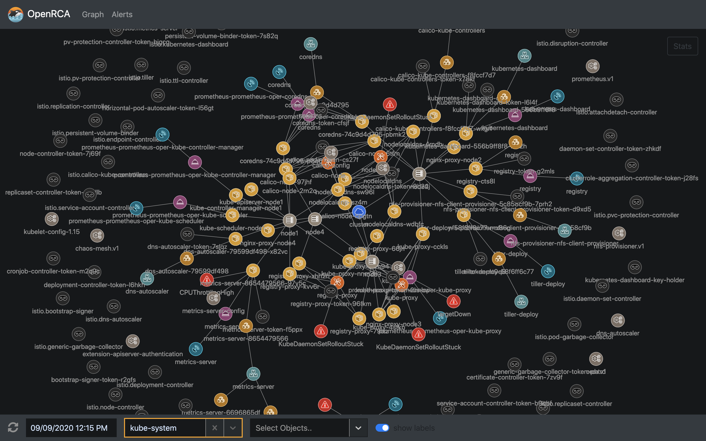
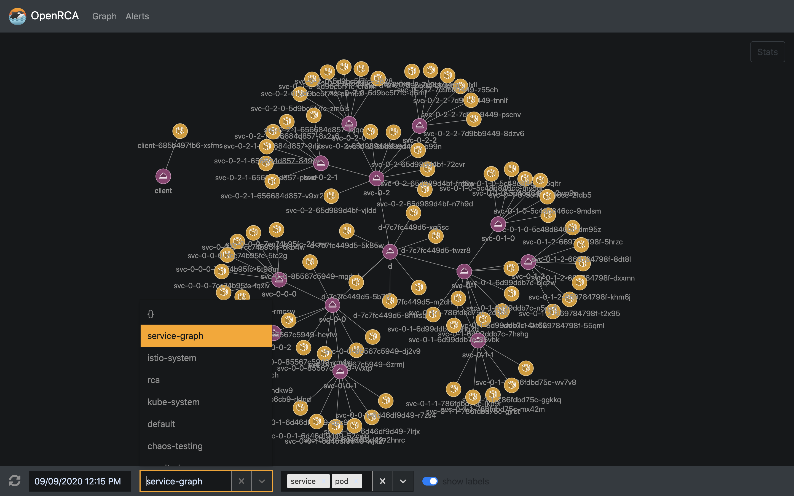
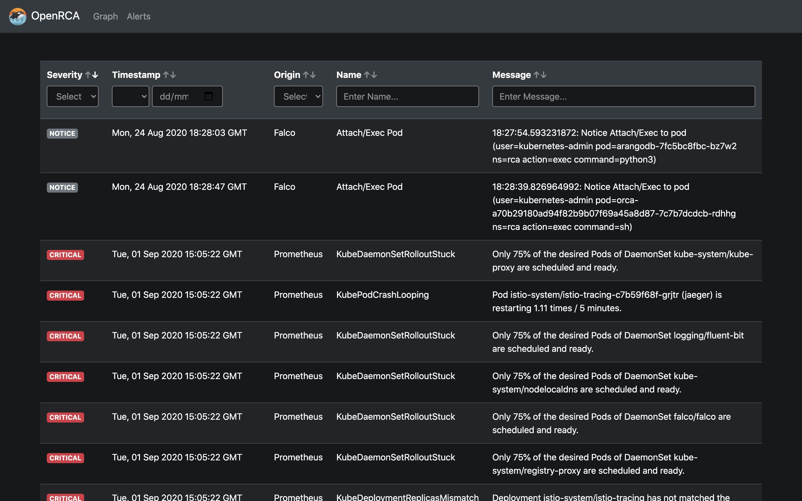

# OpenRCA UI

[](https://bestpractices.coreinfrastructure.org/projects/3912)
[](https://travis-ci.org/openrca/orca-ui)
[](https://github.com/openrca/orca-ui)
[](https://gitter.im/openrca/community)

This repository contains the source code for the OpenRCA web interface.

|              Cluster View              |             Cluster Filtering                  |             Alerts View                |
| :------------------------------------: | :--------------------------------------------: | :------------------------------------: |
|    |  |  |

## Usage

### Build and run in Docker

Build Docker image:

```sh
docker build -t openrca/orca-ui .
```

Run Docker container (specify correct IP and port of API container):

```sh
docker run -it \
    --name orca-ui \
    -e "BACKEND_URL=http://172.17.0.2:5000" \
    -p 80:8080 \
    openrca/orca-ui
```

To specify listen port `LISTEN_PORT` environment variable can be used:

```sh
docker run -it \
    --name orca-ui \
    --network=host \
    -e "LISTEN_PORT=8555" \
    -e "BACKEND_URL=http://127.0.0.1:5000" \
    openrca/orca-ui
```

### Build and run locally

Install dependencies:
```sh
yarn
```

Build:
```sh
yarn build
```

Run:
```sh
yarn start
```

## Development

Navigate to `utils` directory.
Build and start containers by executing command below (requres `docker-compose`):

```sh
docker-compose up
```

Orca UI is now available at [http://localhost](http://localhost).

The code can be modified locally as it is bound to running container.
It will be recompiled on the fly.
Hot reload feature is also enabled, so any changes should be
visible without reloading the webpage.

## Contact

Reach project contributors via these channels:

-   [Gitter chat room](https://gitter.im/openrca/community)
-   [Github issues](https://github.com/openrca/orca-ui/issues)
